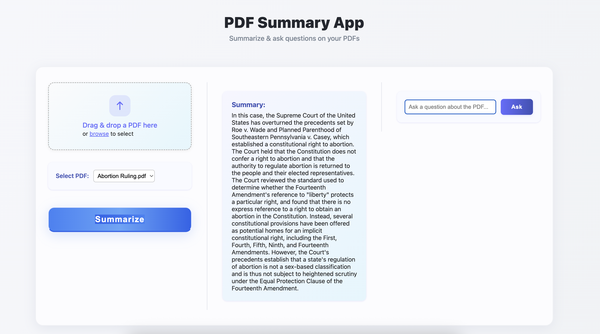

# PDF Summary App



A modern, full-stack SaaS-style application for uploading PDF files, generating AI-powered summaries, and performing Q&A on document content. Built with FastAPI (Python) for the backend and React (Vite) for the frontend. Integrates with local LLMs (Ollama, Llama2) for agentic summarization and question answering.

---

## Features

- **PDF Upload:** Upload and manage multiple PDF files.
- **AI Summarization:** Generate concise, agentic summaries using Llama2 via Ollama.
- **Q&A:** Ask questions about the uploaded PDF and get context-aware answers.
- **Modern UI:** Clean, multi-column SaaS-inspired interface with drag-and-drop upload, summary, and Q&A panels.
- **Modular Codebase:** Separated backend and frontend for easy maintenance and scalability.

---

## Tech Stack

- **Frontend:** React (Vite), modular components, modern CSS-in-JS styling
- **Backend:** FastAPI, PyPDF2, Ollama (Llama2), in-memory PDF tracking
- **AI Integration:** Local LLM via Ollama for summarization and Q&A

---

## Project Structure

```
/pdf-summary-app
├── backend
│   ├── app/
│   │   ├── api/endpoints.py      # API endpoints (upload, summarize, Q&A)
│   │   ├── services/             # Ollama and PDF utilities
│   │   └── ...
│   ├── main.py                   # FastAPI entrypoint
│   ├── requirements.txt
│   └── ...
├── frontend
│   ├── src/
│   │   ├── App.jsx               # Main React app
│   │   ├── components/           # FileUpload, PDFList, SummaryView, QASection, StatusBar
│   │   └── ...
│   ├── package.json
│   └── ...
└── README.md
```

---

## Getting Started

### Prerequisites
- Python 3.9+
- Node.js 18+
- Ollama (for local LLM)

### Backend Setup
```bash
cd backend
python -m venv .venv
source .venv/bin/activate
pip install -r requirements.txt
# Start FastAPI server
uvicorn app.main:app --reload
```

### Frontend Setup
```bash
cd frontend
npm install
npm run dev
```

### Ollama (Llama2) Setup
- Install Ollama: https://ollama.com/
- Pull Llama2 model: `ollama pull llama2`
- Start Ollama server: `ollama serve`

---

## Usage
1. Start backend, frontend, and Ollama server as above.
2. Open the frontend in your browser (default: http://localhost:5173).
3. Upload a PDF, click Summarize, and interact with the Q&A panel.

---

## Customization & Extensibility
- Add new LLMs or endpoints in `backend/app/services/`.
- Extend UI components in `frontend/src/components/`.
- For persistent PDF storage, integrate a database in the backend.

---

## License
MIT

---

## Author
Venkat Manchikalapudi
