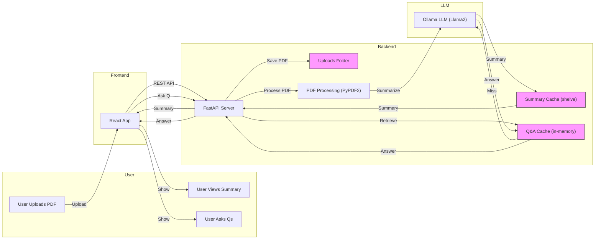

# PDF Summary App – Modern Architecture Flow (Mermaid)

Below is a modern, visual box-and-arrow diagram using Mermaid to represent the high-level flow of the PDF Summary App:

**Legend:**
- User interacts with the React frontend (upload, view summary, ask questions)
- Frontend communicates with FastAPI backend
- Backend processes PDF, stores files, manages summary (persistent) and Q&A (in-memory) caches
- Ollama LLM is used for summarization and Q&A
- Results are returned to the user via the frontend

---
For more details, see the rest of this `architecture.md` and the backend `README.md`.
